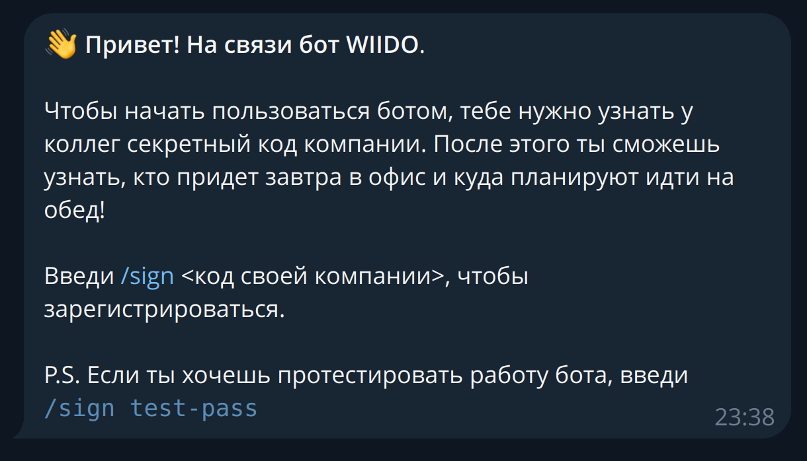
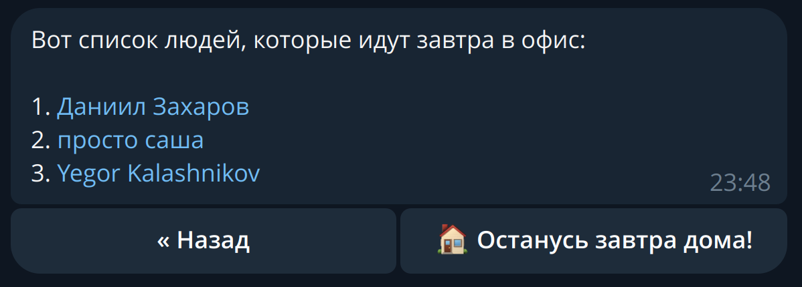

# WIIDO - Who Is In Da Office? (WIP)

Stack

### Frontend
- FastAPI + Uvicorn
- TelegramBotAPI (Raw HTTP Protocol)
- OOP
### Backend
- FastAPI + Uvicorn + Pydantic
- MySQL
- Cron for DB resetting
### Server environment
- CentOS
- Manual SSL configuration
- Deployed with just FastAPI nohup
- Python Logging standart library

[WIIDO](https://t.me/wiido_bot) is the ultimate tool for the office clerk who sees work as more than just work! It lets you sync up your office visits with your friends and even vote on where to go for lunch tomorrow.

  

  

  

  

